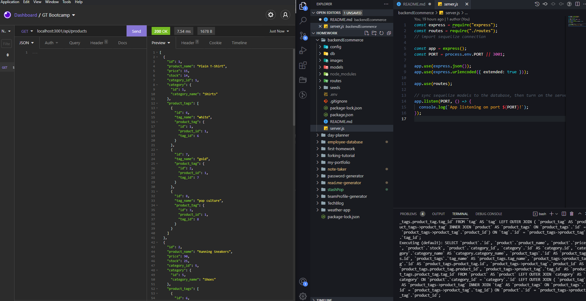
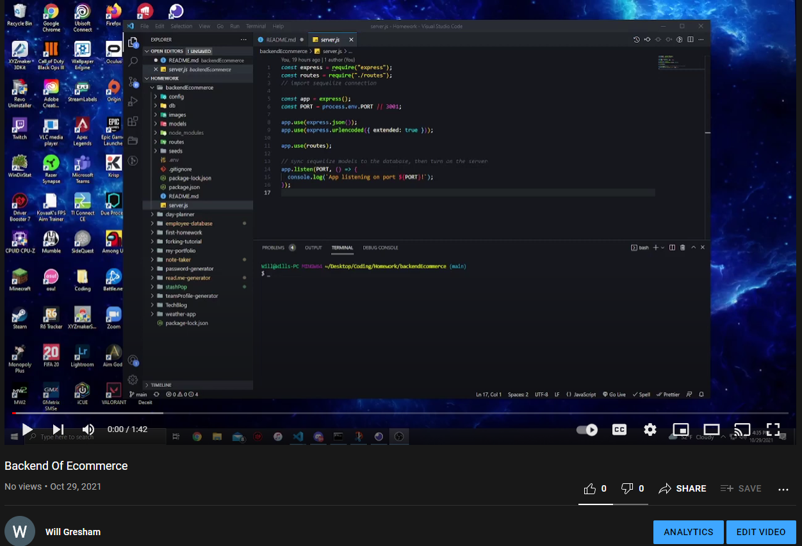

# Backend of Ecommerce

## Description

In this project we used routes to connect the backend of an ecommerce website.

## Table Of Contents

- [Install](#installs)
- [Usage](#usage)
- [license](#license)
- [Contributing](#contributing)
- [Test](#test)
- [Questions](#questions)

## Installation

Dotenv, Express, MySQL2, and Sequalize

## Usage

## Demo

## License

## Contributing

None Needed

## Tests

Test for expected out puts on the Page

## Questions

[GitHub: willgresham34](https://github.com/willgresham34)  
[Email: willgresham34@gmail.com](mailto:willgresham34@gmail.com)
